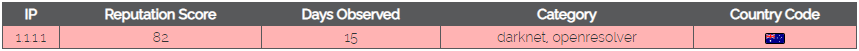
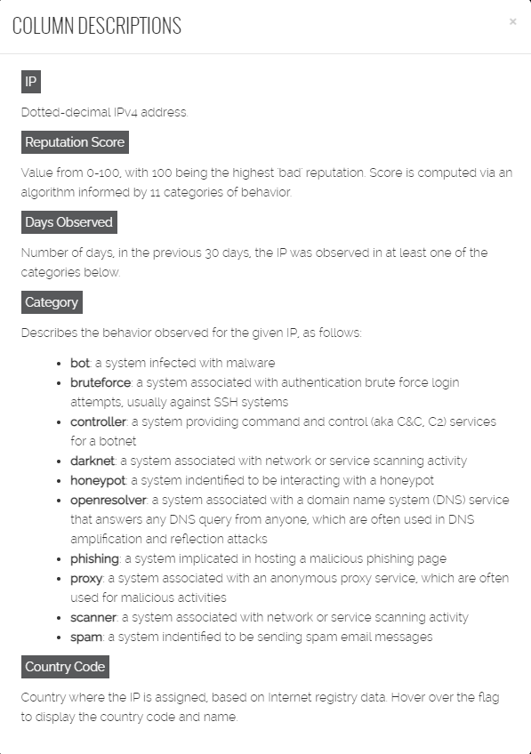

# Description

This is a Logstash filter plugin for teamcymru IP reputation service  
Run

    bundle install
    gem build logstash-filter-teamcymru.gemspec
    $LS_HOME/bin/logstash-plugin install logstash-filter-teamcymru-0.1.0.gem

to install this

# Config
```
filter {
    teamcymru {
        ip => "%YOUR_IP"
        target => "%OUTPUT_FIELD"
        info => "%REQUESTED_FIELD"
    }   
}
```

# Supported options


[Teamcymru IP Reputation Feed](https://reputation.team-cymru.com) provides 3 info types:
 - Reputation Score
 - Days Observed
 - Category

This plugin provides all of them separately by using field "info":
 - "reputation" to get Reputation Score
 - "days_observed" to get Days Observed
 - "category" to get Category

# Categories description
